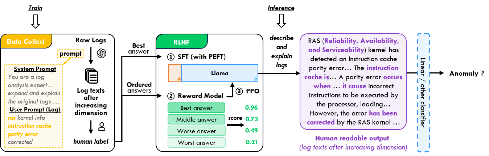

# NLPLog

Repository for the paper: NLPLog: Comprehend Log after Ascending Dimension with Large Language Models

## Framework

<p align="center"><br>Overview of NLPLog</p>

## Data and Models

The data we used and the pre-trained models can be found in the following links:

- Raw logs: https://github.com/logpai/loghub
- The dataset consisting of the descriptions generated by ChatGPT, and the labeled dataset: `./data/chatgpt_explain_data/`
- Pre-trained models: https://drive.google.com/drive/folders/12W-K6urwGR2jNlCr5TAyPFLq-BNj4SyK?usp=sharing


## Demo
### Collect data from ChatGPT

- `./01-data_collection/chatgpt_pipeline.ipynb` calls the ChatGPT API to generate descriptions for each log entry.
- `./01-data_collection/prepare_rlhf_data.ipynb` converts the generated data into a format suitable for RLHF.

### Reinforcement Learning with Human Feedback

> This part of code is editted based on https://github.com/jasonvanf/llama-trl

1. Supervised Fine-tuning (SFT)

    ```bash
    torchrun --nnodes 1 --nproc_per_node 8 \
    02-RLHF/supervised_finetuning.py \
    --base_model 'decapoda-research/llama-7b-hf' \
    --dataset_name './data/rlhf/train80_chatgpt_sft.json' \
    --streaming \
    --lr_scheduler_type 'cosine' \
    --learning_rate 1e-5 \
    --max_steps 4000 \
    --output_dir './checkpoints/supervised_llama/'
    ```

2. Train Reward Model (RM)
    ```bash
    torchrun --nnodes 1 --nproc_per_node 8 \
    02-RLHF/training_reward_model.py \
    --model_name 'decapoda-research/llama-7b-hf' \
    --dataset_name './data/rlhf/log_supplement_comparison_data.json' \
    --output_dir './checkpoints/training_reward_model/'
    ```

3. Tuning Model with Reward Model (PPO)
    ```bash
    python3 02-RLHF/tuning_lm_with_rl.py \
    --log_with wandb \
    --model_name './checkpoints/supervised_llama/checkpoint-1300' \
    --reward_model_name './checkpoints/training_reward_model/opt-1.3b_peft_gpt-4-llm_rm_0_2e-05/checkpoint-600' \
    --adafactor False \
    --tokenizer_name 'decapoda-research/llama-7b-hf' \
    --save_freq 10 \
    --output_max_length 256 \
    --batch_size 16 \
    --gradient_accumulation_steps 8 \
    --batched_gen True \
    --ppo_epochs 4 \
    --learning_rate 1.4e-5 \
    --early_stopping True \
    --output_dir './checkpoints/tuning_llama_rl/' \
    --dataset_name 'train_600.csv'
    ```
### Downstream Tasks

- `./03-task_modules/describe_save.py` generates log descriptions with the RLHFed LLaMA (NLPLog). To accelerate subsequent training, we cache the generated content with [HuggingFace/Datasets](https://huggingface.co/docs/datasets/cache).

    ```bash
    python3 ./03-task_modules/describe_save.py
    ```

- run the demo of downstream tasks through `./03-task_modules/demo.ipynb`.
